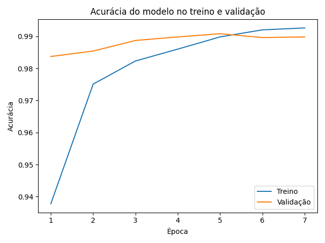
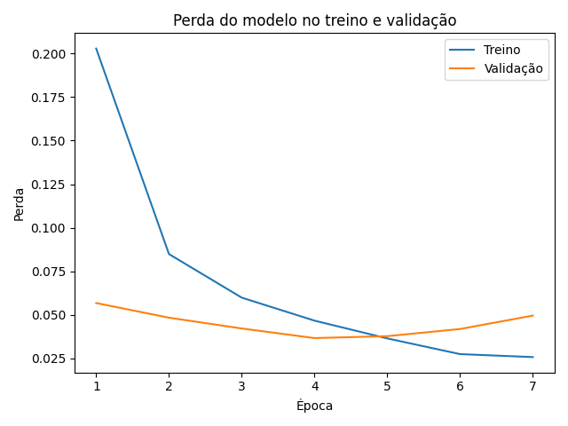

## 📝 Relatório do Candidato

👤 **Nome Completo: Guilherme Emetério Santos Lima**

### 1️⃣ Resumo da Arquitetura do Modelo

O modelo implementado em `train_model.py` é uma rede neural convolucional (CNN) para classificação dos dez dígitos do MNIST. A entrada recebe imagens em tons de cinza com formato `28 × 28 × 1`, normalizadas para o intervalo de 0 a 1.

A CNN possui três blocos convolucionais. Cada bloco contém uma camada `Conv2D` com kernel `3 × 3`, preenchimento `same` e, respectivamente, 32, 64 e 128 filtros. Após cada convolução são aplicadas `BatchNormalization`, ativação ReLU e `MaxPooling2D` com janela `2 × 2`. Essa organização permite extrair características progressivamente mais complexas enquanto reduz as dimensões espaciais das representações.

Na etapa de classificação, a saída convolucional é achatada por uma camada `Flatten`, processada por uma camada densa de 128 neurônios com ReLU e regularizada com `Dropout` de 40%. A camada de saída contém dez neurônios e ativação `softmax`, produzindo a probabilidade de cada classe. No total, a rede possui **242.218 parâmetros**, dos quais 241.770 são treináveis e 448 são não treináveis.

O conjunto de treinamento original foi dividido de forma estratificada em 75% para treino e 25% para validação, com `random_state=42`. O treinamento foi configurado para até dez épocas, usando o otimizador Adam, taxa de aprendizado de 0,001, lote de 16 amostras e perda `sparse_categorical_crossentropy`. Foi utilizado `EarlyStopping` monitorando `val_loss`, com paciência de três épocas, melhora mínima de 0,001 e restauração automática dos melhores pesos.

Após a finalização do treinamento, são exibidos dois gráficos com a evolução da acurácia e da perda nos conjuntos de treino e validação:





### 2️⃣ Bibliotecas Utilizadas

As principais bibliotecas utilizadas foram:

- Python 3.11.6;
- TensorFlow 2.12.0;
- Keras 2.12.0;
- NumPy 1.23.5;
- scikit-learn 1.7.2;
- Matplotlib 3.10.9.

O TensorFlow/Keras foi utilizado para construir, treinar, salvar e converter o modelo. O NumPy auxiliou no preparo dos dados e na seleção da classe predita. O scikit-learn foi empregado na divisão estratificada dos conjuntos de treino e validação, e o Matplotlib na visualização das curvas de acurácia e perda.

### 3️⃣ Técnica de Otimização do Modelo

Em `optimize_model.py`, o modelo Keras salvo em `model.h5` foi convertido para TensorFlow Lite por meio de `tf.lite.TFLiteConverter`. A opção:

```python
converter.optimizations = [tf.lite.Optimize.DEFAULT]
```

ativa a otimização padrão do TensorFlow Lite, que neste caso aplica quantização dinâmica (*dynamic range quantization*). Os pesos elegíveis são armazenados com precisão reduzida, normalmente em 8 bits, enquanto a interface de entrada e saída continua usando ponto flutuante. Durante a inferência, os cálculos necessários são tratados dinamicamente pelo interpretador.

Essa técnica foi escolhida por reduzir consideravelmente o tamanho do modelo e o consumo de memória, sem exigir um conjunto representativo para calibração e sem alterar o código de entrada do modelo. Isso favorece a implantação em dispositivos com recursos limitados.

### 4️⃣ Resultados Obtidos

O treinamento foi interrompido antecipadamente na época 7. Como o `EarlyStopping` monitora a perda de validação, foram restaurados os pesos da época 4, que apresentou `val_loss` de **0,0367** e `val_accuracy` de **98,98%**. Embora a época 5 tenha alcançado 99,08% de acurácia de validação, sua perda foi maior; por isso, ela não foi selecionada pelo critério configurado.

A avaliação posterior no conjunto de teste apresentou:

- perda de teste: **0,0288** (exibida como 0,029 no resumo);
- acurácia de teste: **99,16%**.

Os tamanhos dos artefatos gerados foram:

- `model.h5`: **2.983.560 bytes** (**2.914 KB**, conforme exibido pelo sistema);
- `model.tflite`: **250.008 bytes** (**245 KB**, conforme exibido pelo sistema).

Considerando os valores exatos em bytes, a conversão reduziu o arquivo em aproximadamente **91,62%**, deixando o modelo TFLite com apenas **8,38%** do tamanho original. Apesar dessa redução, o modelo otimizado classificou corretamente as dez amostras utilizadas no teste de inferência.

### 5️⃣ Comentários Adicionais (Opcional)

Uma decisão importante foi utilizar três blocos convolucionais com quantidade crescente de filtros. Essa arquitetura manteve o modelo relativamente compacto, mas ainda foi capaz de aprender padrões gradativamente mais complexos, desde bordas até formas mais abstratas dos dígitos. A normalização em lote ajudou a estabilizar o treinamento, enquanto o `Dropout` e o `EarlyStopping` reduziram o risco de sobreajuste.

A divisão estratificada preservou a proporção das classes no conjunto de validação, tornando a avaliação mais representativa. A quantização dinâmica também ofereceu um bom equilíbrio entre simplicidade de implementação e redução do artefato para Edge AI.

Durante o treinamento, a perda de treino continuou diminuindo, mas a perda de validação voltou a subir após a época 4. Essa divergência indicou o início de sobreajuste e justificou tecnicamente o uso do `EarlyStopping` com restauração dos melhores pesos. O `Dropout` de 40% também foi mantido para reduzir a dependência excessiva de neurônios específicos na camada densa.

Como limitações, o MNIST contém imagens centralizadas, com fundo uniforme e baixa variabilidade. Portanto, a acurácia obtida não garante o mesmo desempenho em fotografias reais, dígitos deslocados, ruído intenso ou estilos de escrita muito diferentes. Além disso, o teste de inferência com dez amostras é apenas uma verificação funcional do arquivo TFLite, não uma avaliação completa da acurácia do modelo quantizado.

### 6️⃣ Exemplo de Inferência

Saída obtida ao executar `run_inference.py`:

```text
INFO: Created TensorFlow Lite XNNPACK delegate for CPU.
Rodando inferencia em 10 amostras usando model.tflite:

Amostra 1: predito=7 | real=7
Amostra 2: predito=2 | real=2
Amostra 3: predito=1 | real=1
Amostra 4: predito=0 | real=0
Amostra 5: predito=4 | real=4
Amostra 6: predito=1 | real=1
Amostra 7: predito=4 | real=4
Amostra 8: predito=9 | real=9
Amostra 9: predito=5 | real=5
Amostra 10: predito=9 | real=9
```

O modelo TFLite acertou as dez amostras testadas. Entre elas, aparecem duas ocorrências do dígito 4, duas do dígito 1 e duas do dígito 9, e todas mantiveram previsões consistentes após a otimização. A mensagem sobre o XNNPACK também confirma que o interpretador ativou o delegado otimizado para execução em CPU. Esses resultados funcionam como evidência de que a conversão foi concluída corretamente e que o artefato otimizado pode ser executado pelo TensorFlow Lite.
